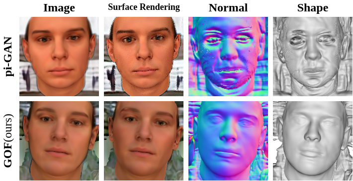

# Generative Occupancy Fields for 3D Surface-Aware Image Synthesis (NeurIPS 2021)
###  [Project Page](https://sheldontsui.github.io/projects/GOF) | [Paper](http://arxiv.org/abs/2111.00969)

[Xudong Xu](https://sheldontsui.github.io/), [Xingang Pan](https://xingangpan.github.io/), [Dahua Lin](http://dahua.me) and [Bo Dai](http://daibo.info/)

GOF can synthesize high-quality images with high 3D consistency and simultaneously learn compact and smooth object surfaces.



## Requirements
* Python 3.8 is used. Basic requirements are listed in the `requirements.txt`
```
pip install -r requirements.txt 
```

## Training
We have put several bash files of BFM, CelebA, and Cats datasets in `auto_bash` for reference.
The adopted hyperparameters in our paper has been listed in the `curriculums.py` file.

If you want to train with your own dataset,
you should set the hyperparameters carefully, especially those related to the camera pose distribution.
Just as the settings in the `curriculums.py` file,
you can leverage some camera pose predictors to obtain the rough 'h_stddev' and 'v_stddev',
and tune them according to the corresponding performance.
Besides, you should add the dataset class in `dataset.py` and modify the reference bash file to fit your own dataset accordingly.

## Evaluation
### Evaluation Metrics
To calculate FID/IS/KID scores, please run
```
python eval_metrics.py path/to/generator.pth --real_image_dir path/to/real_images --curriculum CURRICULUM
```
To calculate weighted variance proposed in the paper, please run
```
python cal_weighted_var.py path/to/generator.pth --curriculum CURRICULUM
```

### Render Multi-view Images
```
python render_multiview_images.py path/to/generator.pth --curriculum CURRICULUM --seeds_start 0 --seeds_end 100
```

### Render Videos
```
python render_video.py path/to/generator.pth --curriculum CURRICULUM --seed 0
```
After running, you will obtain a series of images in a specific folder. And then you can transfer them into a video with ffmpeg:
```
ffmpeg -r 15 -f image2 -i xxx.png -c:v libx264 -crf 25 -pix_fmt yuv420p xxx.mp4
```

Similarly, you can render videos interpolating bettween given latent codes/seeds following:
```
python render_video_interpolation.py path/to/generator.pth --curriculum CURRICULUM --seeds 0 1 2 3
```

### Extract 3D Shapes
You should first generate a voxel npy file by running:
```
python extract_shapes.py path/to/generator.pth --seeds 0 1 2 3
```
and render it to the multi-view mesh images with the `render_meshimg.py` script.

## Pretrained Models
We provide pretrained models for BFM, CelebA, and Cats. Please refer to [this link](https://drive.google.com/drive/folders/1dh2PF29Z4UhS8lk_8WCGDgkoYhKwDBQu?usp=sharing).

As mentioned in the supplementary, the training of all models starts from an early (about 2K iterations) pretrained model with the correct outward-facing faces.
We also provide the early pretrained models for three datasets in [this link](https://drive.google.com/drive/folders/1tXCPJsTZlcQ7BDag7DUJwQFcEbycFsia?usp=sharing).
If you want to start from the early pretrained models, you can replace the 'load_dir' name in bash files in `auto_bash` with the corresponding path of these pretrained models.
Since the optimizer parameters are not provided here, you may need to comment L138~139 out.

## Citation
If you find this codebase useful for your research, please cite:
```
@inproceedings{xu2021generative,
  title={Generative Occupancy Fields for 3D Surface-Aware Image Synthesis},
  author={Xu, Xudong and Pan, Xingang and Lin, Dahua and Dai, Bo},
  booktitle={Advances in Neural Information Processing Systems(NeurIPS)},
  year={2021}
}
```

## Acknowledgement
The structure of this codebase is borrowed from [pi-GAN](https://github.com/marcoamonteiro/pi-GAN).
